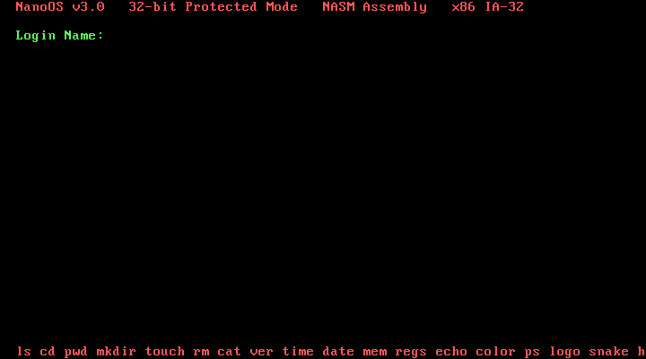
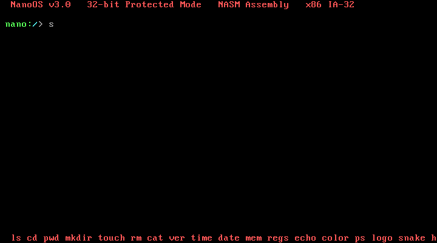
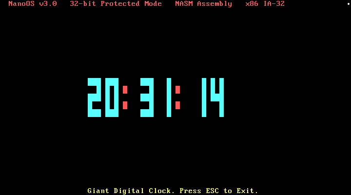
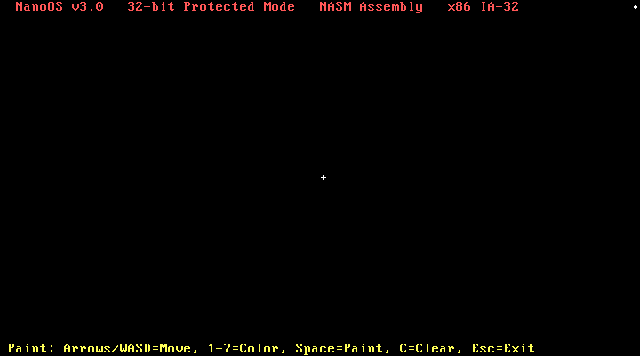

# 🪐 NanoOS v3.0

An educational, bare-metal 32-bit operating system built completely from scratch using **NASM x86 Assembly** (no C, no external libraries!). It boots directly from a custom Stage 1 bootloader on a virtual floppy, switches to 32-bit Protected Mode, sets up GDT and IDT, configures isolated task stacks for a cooperative multitasking kernel, and drops the user into an interactive shell with custom utilities, file browser, and games.

## 👥 Developers
* **Hanan** (Lead Kernel & Graphics Developer)
* **Ahmed** (Lead Shell & App Systems Developer)

---

## 🚀 Key Features

* **Custom Bootloader (Stage 1)**: Formatted as a 512-byte MBR boot sector. Sets up Real Mode segments, loads kernel sectors using BIOS interrupt `INT 0x13`, and transitions to 32-bit Protected Mode.
* **Stable Multitasking Kernel**: Handles isolated kernel and user shell task stacks (preventing stack overflows) and operates cooperative context switching (`sys_yield` via timer tick/software calls).
* **Interrupt Descriptor Table (IDT)**: Correctly remaps Programmable Interrupt Controllers (PICs) and implements custom ISRs and IRQ handlers (specifically IRQ0 for Timer and IRQ1 for Keyboard).
* **Hardware Keyboard Pipeline**: Captures raw PS/2 and Serial input, manages active modifier shift-states, and implements safe backspacing/screen rendering.
* **Interactive Shell**: Robust, case-insensitive parser with argument support. Features over 30 commands, including:
  * **System**: `help`, `about` (credits screen), `clear` / `cls`, `ver`, `time`/`date` (via CMOS RTC), `uptime`, `mem`, `regs` (displays active registers), `ps` (task list).
  * **Filesystem**: Simulated commands `ls`, `cd`, `pwd`, `mkdir`, `rmdir`, `touch`, `rm`, `cat`, `cp`, `mv`, `files` (graphical file browser).
  * **Apps & Games**: `calc` (arithmetic parser), `game` (number guessing), `snake` (interactive WASD terminal game), `fibonacci` sequence, `prime` checker, `tictactoe` (two-player local game), `morse` translator, `sysinfo`, `wc` (word count), `hex` converter, `bootanim` (animated boot sequence), `play` (retro PC speaker music), `paint` (interactive pixel canvas), and `clock` (large digital clock).

---

## 🛠️ Requirements & Setup

### Prerequisites
* **Windows** (Powershell) or **WSL** (Linux shell).
* **NASM** (x86 Assembler) in your System PATH.
* **QEMU** (x86 Emulator) installed to test the OS.

### Building and Running
1. Clone the repository:
   ```bash
   git clone https://github.com/Muhammad-Ahmed-CTRL/NanoOS-v3.git
   cd NanoOS-v3
   ```
2. Run the build script using PowerShell to assemble the binaries and create the `nanoos.img` floppy image:
   ```powershell
   .\build.ps1
   ```
3. **Best way to run natively on Windows (with Sound enabled!)**:
   ```powershell
   & "C:\Program Files\qemu\qemu-system-i386.exe" -fda c:\Users\muham\Downloads\NanoOS\NanoOS\nanoos.img -boot a -m 4M -name "NanoOS v3.0" -audiodev dsound,id=snd0 -machine pc,pcspk-audiodev=snd0 2>&1
   ```
   *(Alternatively, use `.\build.ps1 run` to launch via WSL).*

### Making it Bootable on Real Hardware
When you run `.\build.ps1`, it generates three boot images:

* **`nanoos.img`** - 1.44 MB floppy image for QEMU/virtual floppy boot.
* **`nanoos.iso`** - El Torito CD/floppy-emulation image for virtual CD boot.
* **`nanoos-usb.img`** - raw USB-HDD image for real USB flash drives.

1. **To run it on a real laptop/PC:**
   * Download a tool like [Rufus](https://rufus.ie/).
   * Select your USB drive, and choose the generated `nanoos-usb.img` file.
   * Flash it in raw/DD mode if Rufus asks.
   * Boot it with **Legacy BIOS / CSM** enabled. NanoOS is BIOS-only and does not include a UEFI bootloader, so UEFI-only laptops will not list it as a bootable USB.
2. **To run it in VirtualBox or VMware:**
   * Create a new virtual machine.
   * Mount the `nanoos.iso` file into the virtual CD/DVD drive.
   * Start the VM, and NanoOS will boot instantly!
4. To clean up build artifacts:
   ```powershell
   .\build.ps1 clean
   ```

---

## 📸 Screenshots

Fresh QEMU-verified screenshots after the latest visual cleanup:

| USB-HDD Boot | Idle Restore |
|---|---|
|  |  |

| Giant Clock | Text Paint |
|---|---|
|  |  |

The shell redraws cleanly after the idle animation, and fullscreen apps restore the footer/prompt correctly when exiting.

---

## 🎓 Academic Context
This operating system was built as a semester project for the **Computer Organization and Assembly Language (COAL)** course at **Air University Islamabad**. It demonstrates low-level hardware interaction, CPU architectures, memory segmentations, registers, and system level software without relying on modern high-level operating systems.

---

## 🏷️ Core Concepts & Search Keywords
For developers and students researching low-level systems or the **Air University COAL Project**, this repository provides a reference implementation of:
* **Bare-metal x86 Assembly OS Dev**: Built from scratch using NASM, without C or external standard libraries.
* **Custom 512-byte MBR Bootloader**: Handles 16-bit Real Mode segmenting, sector loading via BIOS `INT 0x13`, A20 gate activation, and transitioning to 32-bit Protected Mode.
* **Interrupt Descriptor Table (IDT) & ISRs**: Re-mapping 8259 PICs, configuring custom ISRs, and managing hardware interrupts (Timer IRQ0 and Keyboard IRQ1).
* **Cooperative Multitasking Kernel**: Task-state stacking, cooperatively switching context (`sys_yield`), and safe stack isolation to prevent buffer overflows.
* **VGA Text Mode & Graphic Applications**: Direct video memory writing (`0xB8000`), a graphical text-mode file browser, real-time keyboard pixel canvas drawing, and console-based games.
